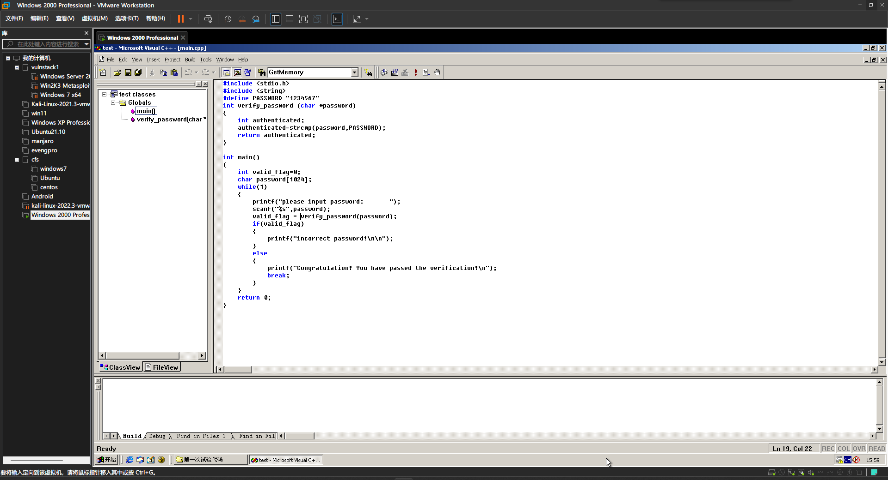

# 2022-9-15-缓冲区溢出实验
#软件安全

## 一、密码验证小程序

### （一） 程序准备

打开win2000虚拟机，用VC6打开工程。

由代码可见，程序读入用户输入的密码后调用``verify_password`函数，函数将真实密码和输入密码进行字符串比较后的返回值作为认证指标赋给变量`valid_flag`，如果`valid_flag`不为零即两密码不相等则进入认证失败分支，反之则认证成功并跳出程序主循环，结束程序。

