# 2022-9-15-缓冲区溢出实验
#软件安全

## 一、目标

1.   读懂并编写密码验证小程序
2.   运行Ollydbg，并学习用其调试密码验证小程序。
3.   修改汇编语句来修改程序的判断条件，改变程序的运行路线。
4.   破解crackme.exe程序，绕过密码验证逻辑，采用2种破解方式方法。

## 二、测试步骤与结果

### （一） 程序准备

打开win2000虚拟机，用VC6打开源代码。

由代码可见，程序读入用户输入的密码后调用``verify_password`函数，函数将真实密码和输入密码进行字符串比较后的返回值作为认证指标赋给变量`valid_flag`，如果`valid_flag`不为零即两密码不相等则进入认证失败分支，反之则认证成功并跳出程序主循环，结束程序。

程序流程图如下所示：

创建新的win32控制台程序

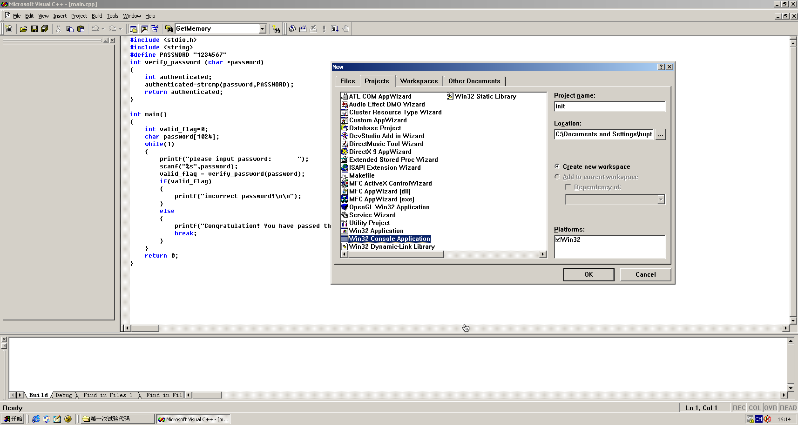

新建C++源代码，把实验代码粘到新建的文件中，保存并点击红色叹号编译运行，输入错误密码123456和正确密码1234567分别看到预期结果。

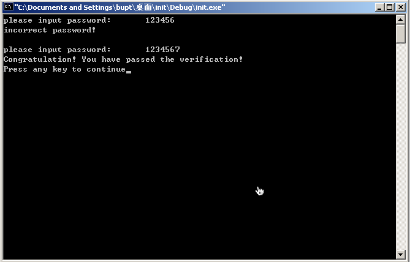

程序准备结束。

### （二） OllyDbg动态调试

将编译好的程序拖入OllyDbg开始动态调试。

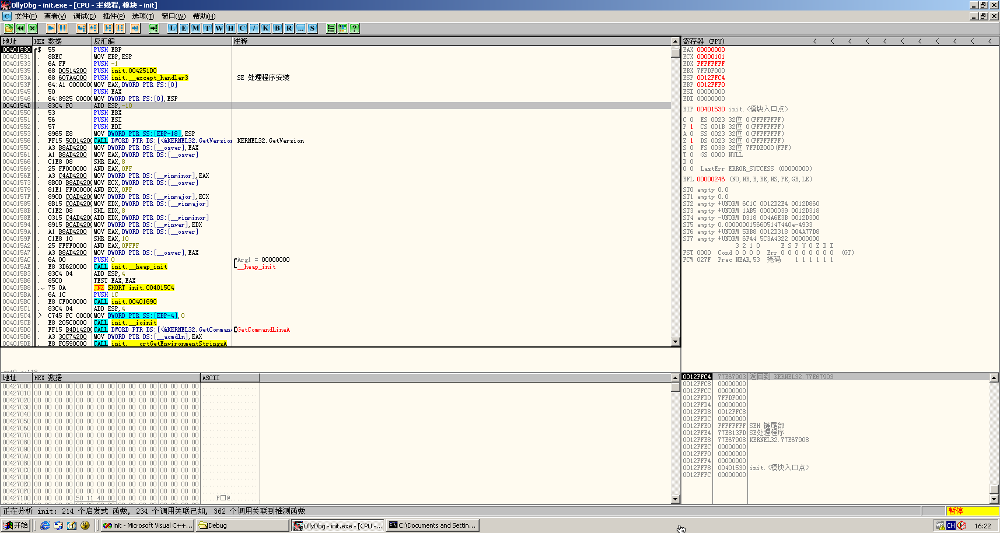

向上翻到地址004010F6，观察该行为打印认证成功的分支的函数调用，上方004010E5处有JE指令即如果结果相等则跳转到004010F6，上方指令为比较DWORD PTR SS:\[EBP-4\]和0，猜测应为strcmp的结果和0的比较，为0即相等即跳转到认证成功。因此我们将JE改为JNE即可将逻辑反转，密码不正确才跳转到认证成功分支，以此来绕过密码判断。

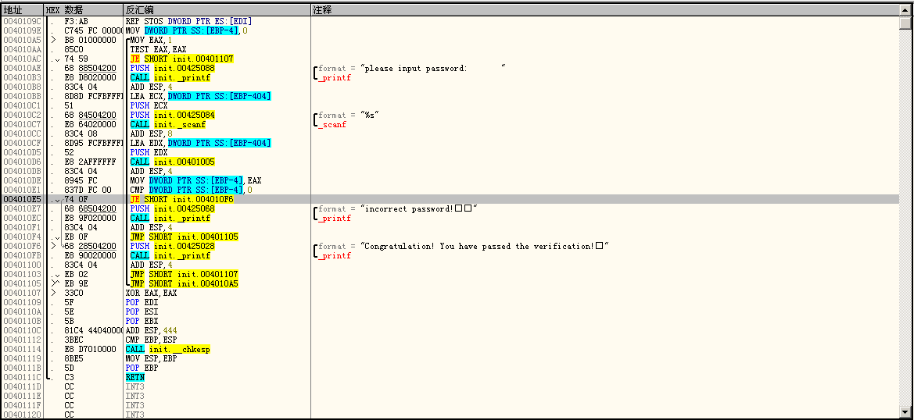

右键该处，选择二进制-编辑，修改74为75，点击确定，点击运行至程序中断等待输入，输入错误密码123456，看到进入认证成功分支，程序结束。

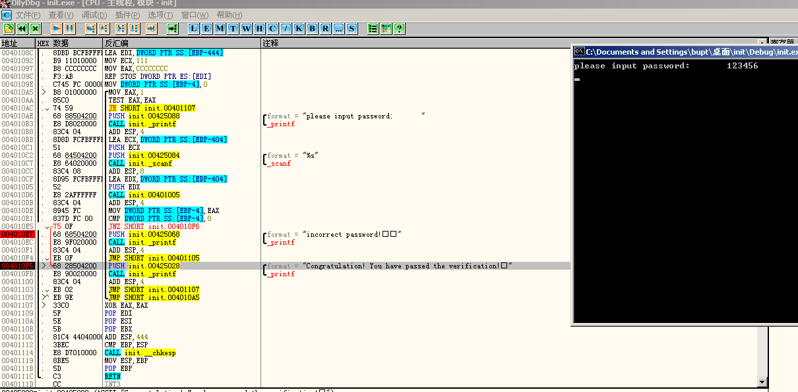

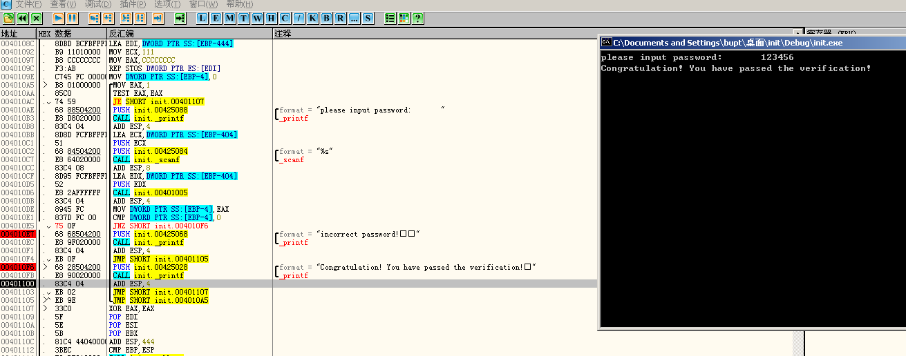

修改后的程序流程图变更为：

.png)

## 三、测试结论

软件如果不对逻辑和内部字符串进行严格保护，很可能被不法分子通过逆向手段破解、非法获取，因此软件安全必须受到重视，可以通过混淆、加密、反调试等技术保护软件安全。

## 四、思考题

### 方法一

IDA打开crackme.exe按`S-<F12>`搜索字符串，看到data段中的字符串crackmepassword猜测为密码。

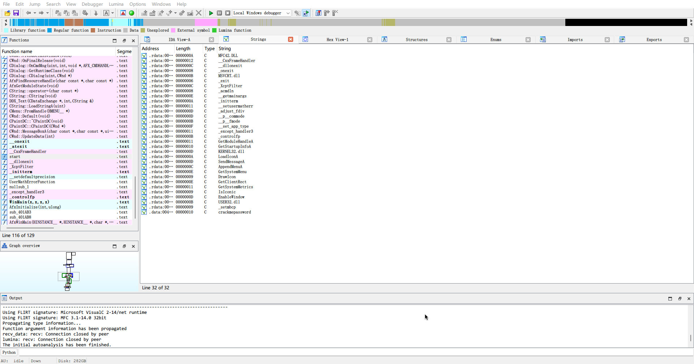

运行程序测试，果然注册成功。

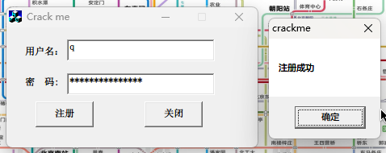

### 方法二

找到密码变量后，经观察，无论密码正确与否都会经对比后跳入`loc_401616`中。

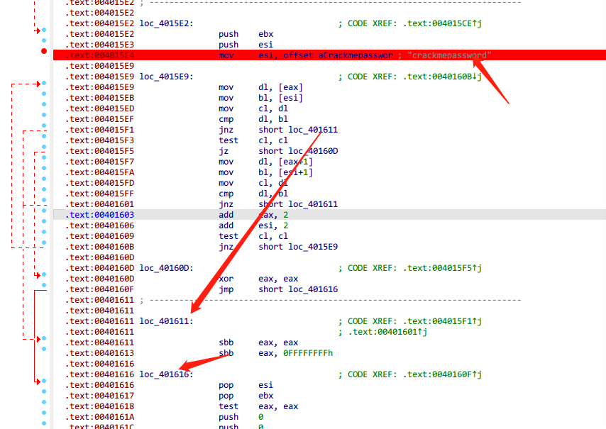

密码正确会经路径1提示注册成功，不正确则会经路径2提示注册失败。

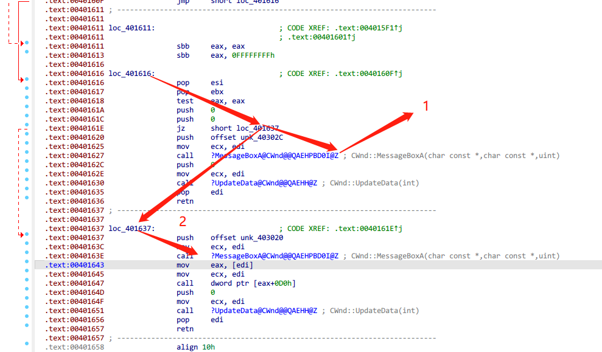

因此Edit - Patch Program - Patch Bytes修改判断处的逻辑为反则错误密码时会经过正确的路径1。

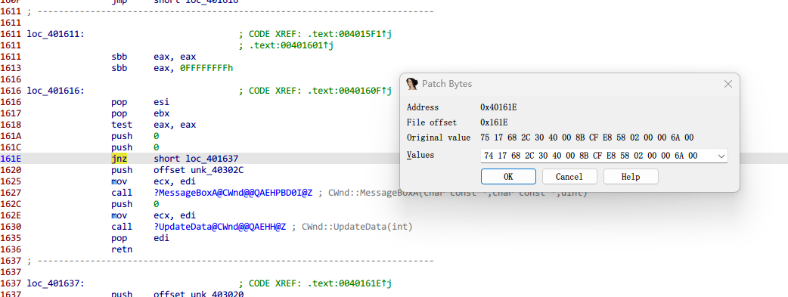

修改后保存至文件，再次打开随便输入用户名密码1/1即可注册成功。

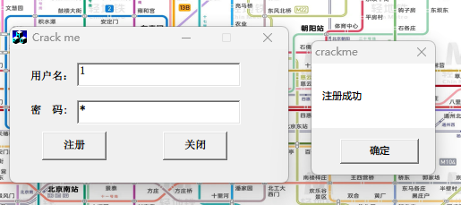
